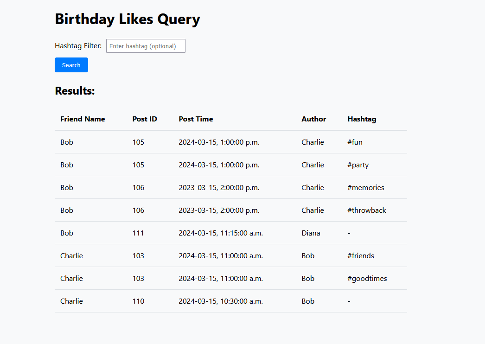
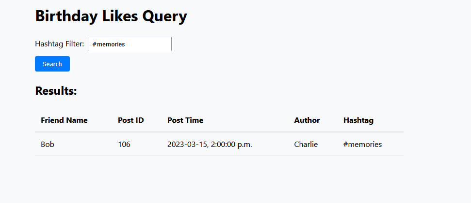
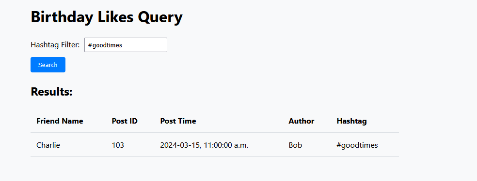

# Debug Challenge

This is a debugging challenge where you need to fix a broken fullstack application. The application has several issues that need to be resolved.

## Project Goal

The application should query and display friends' birthday-related post interactions with the following specific requirements:

For a given user, find all their friends who:
1. Liked posts ON the user's birthday
2. BUT only likes of posts made by the user's other friends (not the user's own posts)
3. AND these friends must NOT have liked any posts made by the user on their birthday

Additionally:
- All hashtags associated with the liked posts should be returned
- Posts without hashtags should still be included in results
- The frontend should display all this information in a table format

## Expected Output

When working correctly, the application should display results similar to these examples:

### Example 1: Full Results View


### Example 2: Filtered Results


### Example 3: Alternative View


[link to image 1](https://nextcloud.zayedfam.com/s/zdJba4aLQqEKmkg)
[link to image 2](https://nextcloud.zayedfam.com/s/coQtzZ4Xdwyycy6)
[link to image 3](https://nextcloud.zayedfam.com/s/67AJDNMoD5pGTPm)

## Current Implementation (Broken)

The project consists of:
1. A Node.js backend server that:
   - Connects to PostgreSQL database
   - Executes a complex query with user ID and optional hashtag filter

2. A React frontend that:
   - Provides hashtag input
   - Displays results in a table
   - Uses hardcoded user ID


## Setup

1. Make sure you have Node.js installed on your system
2. Install dependencies:
```bash
npm install
```

## Running the Server

Start the server with:
```bash
node server.js
```
The server does not hot reload, after any changes you will need to stop the server and rerun. 

## Running the Frontend

Start the frontend with:
```bash
cd frontend
```
```bash
npm i
```
```bash
npm run dev
```